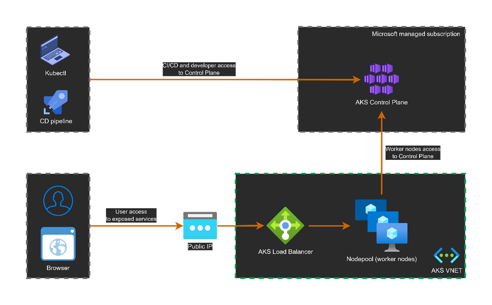
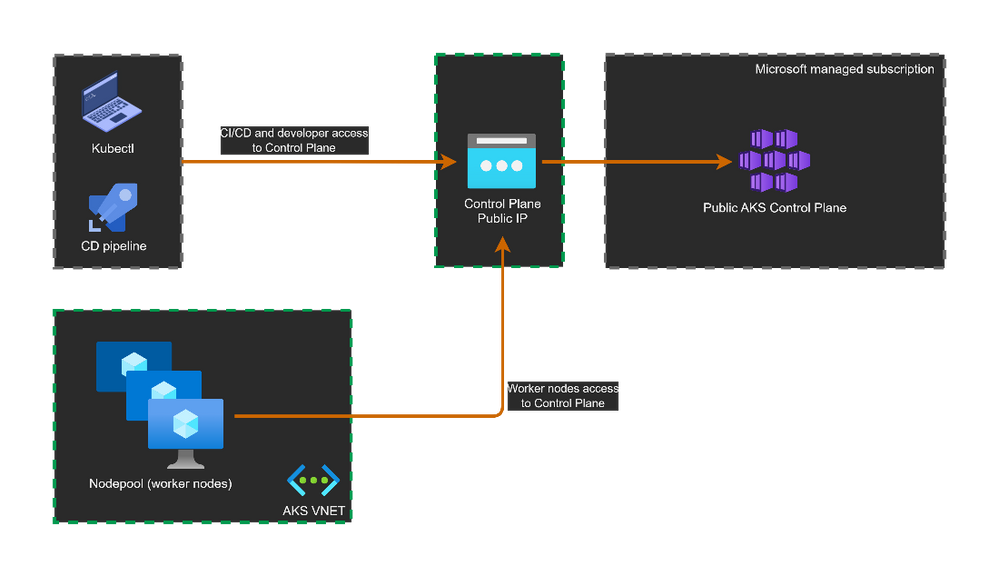
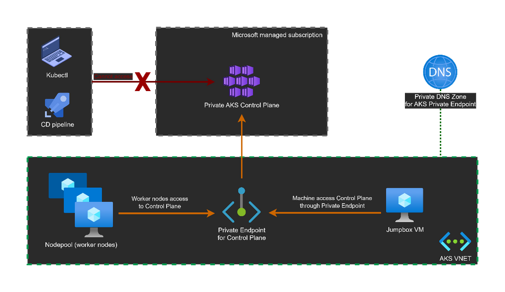
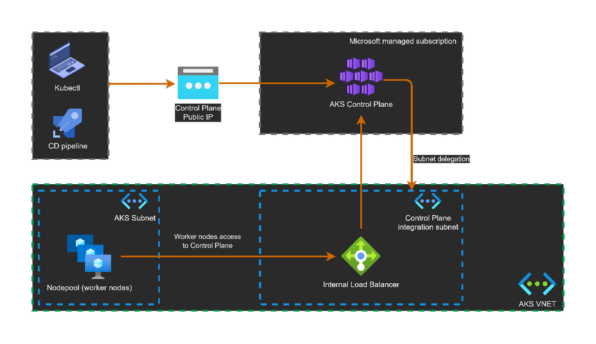
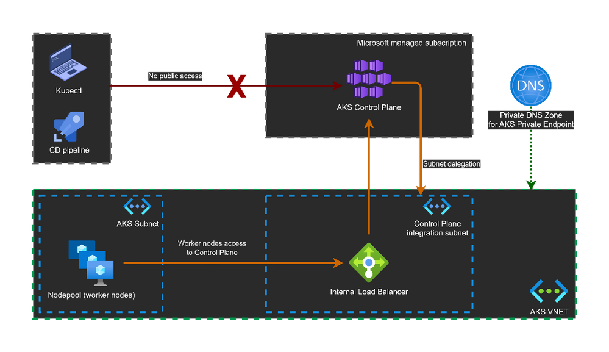

# AKS Training
## Preparation
1. [Azure account](https://azure.microsoft.com/en-us/free/)
2. Install Azure CLI
3. Install kubectl
4. Connect Azure account with AZ CLI

## Notes
- Use Southeast Asia as the main region.
- Use [Azure AKS documentation](https://learn.microsoft.com/en-us/azure/aks/) as the main reference.

## Labs

### Lab 1: Create new AKS cluster
- Use Azure portal: Done
- Use Terraform: 
    - Export these variables to authenticate to Azure:
    ```bash
    export ARM_CLIENT_ID="00000000-0000-0000-0000-000000000000"
    export ARM_CLIENT_SECRET="12345678-0000-0000-0000-000000000000"
    export ARM_TENANT_ID="10000000-0000-0000-0000-000000000000"
    export ARM_SUBSCRIPTION_ID="20000000-0000-0000-0000-000000000000"
    ```
    - Replace vars in config.azure.tfbackend
    - Run this command to init:
    ```bash
    terraform init -backend-config=config.azure.tfbackend
    ```
- Use az CLI command: createAKS.sh
- Use PowerShell module

### Lab 2: Understanding important concepts on AKS
- **Storage:**
  - Built-in CSI drivers: [CSI Storage Drivers](https://learn.microsoft.com/en-us/azure/aks/csi-storage-drivers)
  - Best practice: Only delete the corresponding PVC instead of the PV when delete a CSI volume.
  - Azure Disks: ReadWriteOnce
    - managed-csi: Standard SSD LRS or ZRS
    - managed-csi-premium: Premium SSD ZRS
  - Azure Files: NFS 4.1; SMB 3.0/3.1; Private endpoint (Create SA); parallel; ReadWriteMany
    - azurefile-csi: Standard storage
    - azurefile-csi-premium: Premium storage
  - Azure Blob: large unstructed datasets; BlobFuse or NFS 3.0; can ReadWriteMany 
    - azureblob-fuse-premium
    - azureblob-nfs-premium
- **Network:**
  - Public & private cluster: [Docs](https://techcommunity.microsoft.com/t5/core-infrastructure-and-security/public-and-private-aks-clusters-demystified/ba-p/3716838)
    - By default, it is exposed on a public endpoint accessible over the internet. 
    
    - Type:
      - Public cluster
        - A public cluster will have a public endpoint for the control plane called fqdn. It is in form of: <unique_id>.hcp..azmk8s.io. And it resolves to a public IP. 
        ```bash
        az aks show -n aks-cluster -g rg-aks-public --query fqdn 
        # output: "aks-cluste-rg-aks-private-17b128-93acc102.hcp.westeurope.azmk8s.io" 
        nslookup aks-cluste-rg-aks-public-17b128-93acc102.hcp.westeurope.azmk8s.io 
        # output: 
        # Address: 20.103.218.175 
        ```
        - AKS Rest API defines a property called privateFqdn. Its value is null because this is a public cluster. 
        ```bash
        az aks show -n aks-cluster -g rg-aks-public --query privateFqdn 
        # output: null 
        ```
        - Cluster operators and worker nodes connect to the control plane: use the public endpoint (public IP)
        - Worker nodes connect to control plane over public endpoint (within Azure backbone). 
        ```bash
        kubectl get svc 
        # NAME         TYPE        CLUSTER-IP   EXTERNAL-IP   PORT(S)   AGE 
        # kubernetes   ClusterIP   10.0.0.1     <none>        443/TCP   113m 
        kubectl describe svc kubernetes 
        # IPs:               10.0.0.1 
        # Port:              https  443/TCP 
        # TargetPort:        443/TCP 
        # Endpoints:         20.103.218.175:443 
        kubectl get endpoints 
        # NAME         ENDPOINTS            AGE 
        # kubernetes   20.103.218.175:443   114m 
        ```
        
      - Private cluster
        - A private AKS cluster disable the public endpoint and creates a private endpoint to access the control plane.
        
        ```bash
        az aks create -n aks-cluster -g rg-aks-private --enable-private-cluster 
        ```
        - The private cluster still (by default) exposes a public FQDN resolving the private endpoint IP address. 
        ```bash
        # get the public FQDN 
        az aks show -n aks-cluster -g rg-aks-private --query fqdn 
        # output: "aks-cluste-rg-aks-private-17b128-32f70f3f.hcp.westeurope.azmk8s.io" 
        # resolve the public FQDN 
        nslookup aks-cluste-rg-aks-private-17b128-32f70f3f.hcp.westeurope.azmk8s.io 
        # output: 
        # Address:  10.224.0.4 
        ```
        - In private cluster, the exposed public FQDN could be disabled. 
        ```bash
        # disable public FQDN 
        az aks update -n aks-cluster -g rg-aks-private --disable-public-fqdn 
        # resolve the public (disabled) FQDN 
        az aks show -n aks-cluster -g rg-aks-private --query fqdn 
        # output: null (no public fqdn) 
        ```
        - Important notes:
          - Restarting the private cluster will recreate a new Private Endpoint with different private IP.
          - In a Hub & Spoke model, more attention is needed to manage the Private DNS Zone
          - No support for public agents like Github Actions or Azure DevOps Microsoft-hosted Agents with private clusters. Consider using Self-hosted Agents. 
          - No support for converting existing AKS clusters into private clusters. 
          - AKS control plane supports adding multiple Private Endpoints. 
          - Worker nodes connect to control plane using private endpoint. 
      - Public cluster with API Integration enabled
        
        - We will have a public endpoint (public IP) for cluster operators
        - To expose private access, unlike a private cluster that uses Private Endpoint here, we will use the VNET Integration.
        ```bash
        az aks create -n aks-public-vnet -g Azuredevops --enable-apiserver-vnet-integration
        ```
        - Retrieve the public endpoint which will resolve into public IP. 
        ```bash
        # get the public FQDN 
        az aks show -n aks-cluster -g rg-aks-public-vnet-integration --query fqdn 
        # output: "aks-cluste-rg-aks-public-vn-17b128-2ab6e274.hcp.eastus2.azmk8s.io" 
        # resolve the public FQDN 
        nslookup aks-cluste-rg-aks-public-vn-17b128-2ab6e274.hcp.eastus2.azmk8s.io 
        # output: 
        # Address:  20.94.16.207 
        ```
        - However, the private FQDN does not resolve anything. That is because the privateFQDN attribute is used only for Private Endpoint and not for VNET Integration. 
        ```bash
        # get the private FQDN 
        az aks show -n aks-cluster -g rg-aks-public-vnet-integration --query privateFqdn 
        # output: not found 
        ```
        - If we look at the kubernetes service endpoint within the cluster, we can see the same private IP as in the internal Load Balancer. 
        ```bash
        kubectl get svc 
        # NAME         TYPE        CLUSTER-IP   EXTERNAL-IP   PORT(S)   AGE 
        # kubernetes   ClusterIP   10.0.0.1     <none>        443/TCP   178m 
        kubectl describe svc kubernetes 
        # IPs:               10.0.0.1 
        # Port:              https  443/TCP 
        # TargetPort:        443/TCP 
        # Endpoints:         10.226.0.4:443 
        kubectl get endpoints 
        # NAME         ENDPOINTS        AGE 
        # kubernetes   10.226.0.4:443   178m 
        ```
      - Private cluster with API Integration enabled
        - Default VNET Integration will create private access for the worker nodes to access the control plane through internal Load Balancer.
        
        ```bash
        az aks create -n aks-cluster -g rg-aks-private-vnet-integration --enable-apiserver-vnet-integration --enable-private-cluster 
        ```
        - Note here how the public FQDN (could be disabled) resolves to the private IP. 
        ```bash
        # get the public FQDN 
        az aks show -n aks-cluster -g rg-aks-private-vnet-integration --query fqdn 
        # output: "aks-cluste-rg-aks-private-v-17b128-4948be0c.hcp.eastus2.azmk8s.io" 
        # resolve the public FQDN 
        nslookup aks-cluste-rg-aks-private-v-17b128-4948be0c.hcp.eastus2.azmk8s.io 
        # output: 
        # Address:  10.226.0.4 
        ```
        - Sure enough, the private FQDN could not be resolved outside the AKS network. 
        - How to access API Server: [Connect](https://learn.microsoft.com/en-us/azure/aks/private-clusters?tabs=azure-portal#options-for-connecting-to-the-private-cluster)
          - Az AKS command invoke –command “kubectl get pods” 
          - JumpBox VM inside the AKS VNET or peered network 
          - Use an Express Route or VPN connection 
    
    |  | Public FQDN | Private FQDN | Public FQDN could be disactivated | How to access Control Plane |
    |---|---|---|---|---|
    | Public cluster | Yes (public IP)  | No  | No | Public IP/FQDN for Control Plane |
    | Private cluster | Yes (private IP) | Yes (Private Endpoint) | Yes | Private Endpoint + Private DNS Zone |
    | VNET Integration + public cluster | Yes (public IP) | Yes (private IP of internal Load Balancer) | No | VNET Integration + Internal Load Balancer |
    | VNET Integration + private cluster | Yes (private IP) | Yes (private IP of internal Load Balancer) | Yes | VNET Integration + Internal Load Balancer + Private DNS Zone |
  - Azure CNI vs Kubelet CNI
- **Nodepool:**
  - Manage node pool: [Manage Node Pools](https://learn.microsoft.com/en-us/azure/aks/manage-node-pools)
    - 2 types of node pool:
      - System node pool
      - User node pool
    - Node pools with unique subnets
    - Node pools with Ephemeral OS disks
    - Can associate an existing capacity reservation group
    - Adding taints, labels, or tags to nodes should be done for the entire node pool using az aks nodepool.
    - AKS supports two kinds of node taints: node taints and node initialization taints (preview)
  - OS disk type: [Disk](https://techcommunity.microsoft.com/t5/fasttrack-for-azure/everything-you-want-to-know-about-ephemeral-os-disks-and-azure/ba-p/3565605)
    - Ephemeral: not save to Azure Storage
    - Managed Disk: save to Azure Storage
- **Cluster authorizations:** [Docs](https://learn.microsoft.com/en-us/azure/aks/concepts-identity#kubernetes-rbac)
  - Note: Microsoft/AKS performs any cluster actions with user consent under a built-in Kubernetes role aks-service and built-in role binding aks-service-rolebinding.
  - Azure AD authentication with Kubernetes RBAC [Docs](https://learn.microsoft.com/en-us/azure/aks/azure-ad-rbac?tabs=portal)
    - Choose this option if you want to use Azure RBAC just to decide who will be able to get AKS credentials but Kubernetes YAML manifests to describe what these users can do inside the cluster
    - Your cluster becomes more portable because it contains all the role bindings definition in it, even if these bindings contain Azure-specific group IDs and users in their definitions
    - Checking who have access to what inside the cluster is not so easy when working with AD groups because you need to work with group IDs in the YAML and not their display names; make sure to save your YAML definitions in a source control with proper line commenting to make that correlation easier
  - Azure AD authentication with Azure RBAC [Docs](https://learn.microsoft.com/en-us/azure/aks/manage-azure-rbac?source=recommendations&tabs=azure-cli)
    - Choose this option if you want to use Azure RBAC just to decide who and what users can do inside the cluster. This is a YAML-free option to deal with user access in AKS
    - To give/list permissions to specific namespaces, you need to use the Az CLI for the moment. There is no option in the Portal yet to manage that. The Access Control (IAM) blade for AKS assigns roles for the entire cluster
  - Local accounts with Kubernetes RBAC [Docs](https://techcommunity.microsoft.com/t5/fasttrack-for-azure/azure-kubernetes-service-rbac-options-in-practice/ba-p/3684275)
    - Only use this if the users of the AKS cluster have no possibility to be
    in Azure AD for some reason
    - Managing users in "raw" Kubernetes becomes really complex with big teams
- **Optional:**
  - Observability
  - Upgrade

### Lab 3: Deploy simple application into AKS
- **Create new ACR:** [Docs](https://learn.microsoft.com/en-us/azure/container-registry/container-registry-concepts)
  - Create new ACR
  - Build and push image to ACR
  - Delete/Untag ACR images - what is the difference? [Docs](https://learn.microsoft.com/en-us/azure/container-registry/container-registry-delete)
    - Deleting by tag shouldn't be confused with deleting a tag (untagging). No space is freed when you untag an image because its manifest and layer data remain in the registry. Only the tag reference itself is deleted.
- **Deploy sample application:**
  - Use the image from ACR (Use cluster identity): Assign Role to kubeletidentity (Managed Identity)
  - Configure scaling:
    - Manual
    - Auto with HPA and VPA
      - HPA: [Docs](https://learn.microsoft.com/en-us/azure/aks/concepts-scale)
        - Check Metrics API every 15 seconds for any required changes in replica count
        - Metrics API retrieves data from the Kubelet every 60 seconds
        - The default delay on scale down events is 5 minutes.
      - VPA: [Docs](https://learn.microsoft.com/en-us/azure/aks/vertical-pod-autoscaler)
        - The VPA automatically sets resource requests and limits on containers per workload based on past usage
        - A pod with a scaling mode set to auto or recreate is evicted if it needs to change its resource requests.
        - VPA supports a maximum of 1,000 pods associated with VerticalPodAutoscaler objects per cluster.
        - VPA object consists of three components:
          - Recommender: current and past resource consumption, including metric history, Out of Memory (OOM) events, and VPA deployment specs, and uses the information it gathers to provide recommended values for container CPU and Memory requests/limits.
          - Updater: The Updater monitors managed pods to ensure that their resource requests are set correctly. If not, it removes those pods so that their controllers can recreate them with the updated requests.
          - VPA Admission Controller: The VPA Admission Controller sets the correct resource requests on new pods either created or recreated by their controller based on the Updater's activity.
        - Respect Pod Distribution Budget
        - VPA determines if a pod needs to scale based on:
          - Resource usage metrics: Current and historical CPU and memory usage.
          - Historical data: Trends and usage patterns over time.
          - Recommendations: Provided by the Recommender component based on collected metrics and historical data.
          - Thresholds and policies: Predefined criteria for when to update resource requests.
        - 4 modes:
          - Auto: VPA evicts a pod if it needs to change its resource requests
          - Recreate: VPA assigns resource requests during pod creation and updates existing pods by evicting them 
          - Initial: : VPA only assigns resource requests during pod creation and does not update existing pods.
          - Off:  VPA does not automatically change the resource requirements of the pods.
      ```yaml
      apiVersion: autoscaling.k8s.io/v1
      kind: VerticalPodAutoscaler
      metadata:
        name: my-app-vpa
        namespace: my-namespace
      spec:
        targetRef:
          apiVersion: "apps/v1"
          kind:       Deployment
          name:       my-app
        updatePolicy:
          updateMode: "Auto"  # Can be "Auto", "Recreate", "Initial", or "Off"
        resourcePolicy:
          containerPolicies:
          - containerName: "my-container"
            minAllowed:
              cpu: "200m"
              memory: "256Mi"
            maxAllowed:
              cpu: "2"
              memory: "2Gi"
      ```
  - Configure Pod Distribution Budget: Decide how many instances can be down at the same time for a short period due to a voluntary disruption. [Docs](https://kubernetes.io/docs/tasks/run-application/configure-pdb/)

- **App source:** [Prepare App](https://learn.microsoft.com/en-us/azure/aks/tutorial-kubernetes-prepare-app)

### Lab 3 & 4: Cluster & NodePool operations
- Create node pool snapshot + Create new node pool with this snapshot [Docs](https://learn.microsoft.com/en-us/azure/aks/node-pool-snapshot)
  - The snapshot is an Azure resource that contains the configuration information from the source node pool, such as the node image version, kubernetes version, OS type, and OS SKU
  - Restored nodepool from a snapshot doesn't remain taints, labels
- **Node pool scaling:**
  - Manual [Docs](https://learn.microsoft.com/en-us/azure/aks/scale-cluster?tabs=azure-cli)
  - Auto [Docs](https://learn.microsoft.com/en-us/azure/aks/cluster-autoscaler?tabs=azure-cli)
    - The cluster autoscaler periodically checks for pods that can't be scheduled on nodes because of resource constraints [Docs](https://github.com/kubernetes/autoscaler/blob/master/cluster-autoscaler/FAQ.md#how-does-scale-up-work)
    - The Horizontal Pod Autoscaler uses the Metrics Server in a Kubernetes cluster to monitor the resource demand of pods
    - The Vertical Pod Autoscaler automatically sets resource requests and limits on containers per workload based on past usage
  - Scaling mechanism? [Docs](https://learn.microsoft.com/en-us/azure/aks/cluster-autoscaler-overview?source=recommendations)
    - **Scale Up:**
      - Adds nodes when there are pending pods that cannot be scheduled due to insufficient resources.
      - Checks for unschedulable pods every 10 seconds by default.
      - Examines resource requests (CPU and memory) of pending pods.
      - Uses node templates to determine the type and size of nodes to add.
      - Interacts with the API server to gather information about pending pods and current node status.
    - **Scale Down:**
      - Removes nodes when they are underutilized and their pods can be rescheduled onto other nodes.
      - Checks for underutilized nodes every 10 seconds by default.
      - Monitors resource utilization (CPU and memory) of each node.
      - Ensures pods can be rescheduled without causing disruption.
      - Respects Pod Disruption Budgets (PDBs).
      - Nodes with critical system pods or pods that cannot be moved are not removed.
      - Interacts with the API server to gather information about node utilization and pod rescheduling.
### AKS Cluster Upgrade Process
- **Add Buffer Node(s) / Surge Nodes:**
  - Adds a new buffer node (or as many nodes as configured in max surge) to the cluster that runs the specified Kubernetes version.
- **Cordon and Drain Old Nodes:**
  - Cordons and drains one of the old nodes to minimize disruption to running applications. If using max surge, it cordons and drains as many nodes at the same time as the number of buffer nodes specified.
- **Node Drain Timeout:**
  - For long-running pods, configure the node drain timeout to allow custom wait time on the eviction of pods and graceful termination per node. Default is 30 minutes, minimum is 5 minutes.
- **Reimage Drained Nodes:**
  - When the old node is fully drained, it is reimaged to receive the new version and becomes the buffer node for the following node to be upgraded.
- **Node Soak Time:**
  - Optionally set a duration to wait between draining a node and reimaging it. Minimum is 0 minutes, maximum is 30 minutes. Default is 0 minutes.
- **Repeat Process:**
  - This process repeats until all nodes in the cluster are upgraded.
- **Delete Last Buffer Node:**
  - At the end of the process, the last buffer node is deleted, maintaining the existing agent node count and zone balance.
- **Upgrade cluster:** [Docs](https://learn.microsoft.com/en-us/azure/aks/upgrade-cluster)
  - Upgrade entire cluser
  ```bash
  az aks upgrade \
    --resource-group myResourceGroup \
    --name myAKSCluster \
    --kubernetes-version <KUBERNETES_VERSION>
  ```
  - Upgrade control plane only
  ```bash
  az aks upgrade \
    --resource-group myResourceGroup \
    --name myAKSCluster \
    --control-plane-only \
    --kubernetes-version <KUBERNETES_VERSION>
  ```
  - Upgrade worker (both system & user) node only:
  ```bash
  az aks nodepool upgrade \
    --resource-group myResourceGroup \
    --cluster-name myAKSCluster \
    --name <nodepool-name> \
    --kubernetes-version <KUBERNETES_VERSION>
  ```
  - What is surge node? [Docs](https://learn.microsoft.com/en-us/azure/aks/upgrade-aks-cluster?tabs=azure-cli#customize-node-surge-upgrade)
  - How to mitigate downtime during AKS upgrade? (Blue-Green)
    - Create new nodepool (with new version). Then cordon old nodepool.
    - Create new nodepool (with new version). Deploy app using helm to that nodepool. Test app and then delete old nodepool.

### Lab 5: Integrate with Azure Key Vault [Docs](https://learn.microsoft.com/en-us/azure/aks/csi-secrets-store-driver)
- Install CSI Secret Store Driver
- Create new AKV, push some random secrets to it
- 2 methods:
  - **Microsoft Entra Workload ID** [Docs](https://learn.microsoft.com/en-us/azure/aks/csi-secrets-store-identity-access#access-with-a-microsoft-entra-workload-id)
    ```bash
    az aks update --resource-group "${RESOURCE_GROUP}" --name "${CLUSTER_NAME}" --enable-oidc-issuer --enable-workload-identity
    ```
    - **Mechanism:**
      - **Service Account Token:**
        - Each pod can be associated with a service account.
        - The service account token is projected into the pod's volume.
      - **OIDC Federation:**
        - AKS acts as an OIDC token issuer.
        - Microsoft Entra ID uses OIDC to verify the service account token.
      - **Token Exchange:**
        - The application uses the Azure Identity client library or MSAL to exchange the service account token for a Microsoft Entra token.
        - The Microsoft Entra token is used to authenticate against Azure services.
  - User-assigned managed identity [Docs](https://learn.microsoft.com/en-us/azure/aks/csi-secrets-store-identity-access#access-with-managed-identity)

### Lab 6: Namespace actions
- Create new namespace
- **Implement namespace role binding:**
  - Admin permission on namespace scope
  - Admin permission on namespace but unable to view/edit K8s secrets
  - Read-only on namespace
  - Read-only on cluster
  - Admin permission on cluster

### Lab 7: Ingress Controller
- Deploy new ingress controller:
  - Source: [Ingress Basic](https://learn.microsoft.com/en-us/azure/aks/ingress-basic?tabs=azure-cli)
    - Reverse proxy 
    - Traffic routing
    - TLS termination
  - Using helm chart
  - Load Balancer IP:
    - Random
    - Specific

### Lab 8: DNS
- Create a Windows virtual machine
- Install DNS service
- **Create:**
  - New zone
  - New forwarded zone
  - New AAAA records
  - New CNAME records

